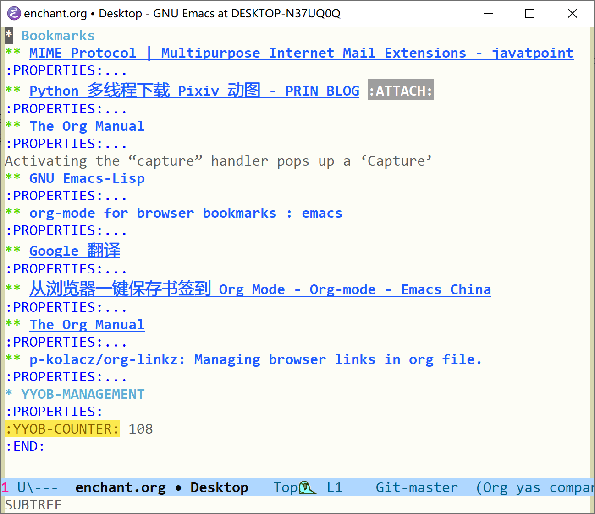

yyorg-bookmark —— 基于 org-mode 的书签管理插件
======



## 相关项目

- [org-capture-extension](https://github.com/sprig/org-capture-extension)
- [org-capture-tag-bookmark](https://github.com/toure00/org-capture-tag-bookmark)
- [org-protocol-capture-html](https://github.com/alphapapa/org-protocol-capture-html#org-protocol-instructions)
- [org-linkz](https://github.com/p-kolacz/org-linkz)
- [grasp](https://github.com/karlicoss/grasp)

## 概述

`yyorg-bookmark` 是一个基于 org-mode 的书签管理插件，提供了从浏览器一键收藏，在书签文件内一键下载网页等方便功能，可用于书签，图片等文件的整理。只需将 enchant.org 文件中的内容放在任意文件尾部即可将该文件作为书签存储文件来使用，这只需要在书签文件中调用 `yyorg-bookmark-enchant` 即可。

在书签文件中我设置了一些快捷键

- `C-c k` 删除光标所在位置书签
- `C-c i` 将光标所在位置书签放入缓存中
- `C-c m` 根据当前书签更新缓存
- `C-c u` 从书签 url 下载网页
- `C-c r` 清空 `org-agenda-files`

由于本人不是经常使用 linux 系统，下载网页的函数 `yyorg-bookmark-use-wget` 需要少许修改以在 linux 上正常运行。

## 环境要求与安装

- 本插件使用了 shorthands 功能，故需要 emacs28.1 或以上
- Windows 操作系统
- 若使用 linux，可参考最上面相关项目 `org-capture-extension` 中的配置方法

首先，下载本插件并将 `yyorg-bookmark.el` 添加到 emacs 的 `load-path` 上

``` shell
git clone https://github.com/include-yy/yyorg-bookmark
```

``` elisp
(add-to-list 'load-path "path/to/yyorg-bookmark.el")
```

若要使用 wget 下载网页，需要配置 `yyorg-bookmark-wget-path` 为 wget.exe 所在位置：

``` elisp
(setq yyorg-bookmark-wget-path "path/to/wget.exe")
```

如果要使用 org-protocol 功能，需要以下两步操作：

- 根据 emacsclient 所在位置修改 `add-org-reg.reg` 内容并运行之，或手动在 `regedit` 中添加注册表项。

- 在浏览器中安装 tampermonkey，并将 `tmscript.js` 放入其中运行。

最后通过函数 `yyorg-bookmark-enchant` 在书签文件中添加管理代码即可。

## 简单配置

文件 `enchant.org` 中默认有两个 org-capture 模板，"l" 作为示例模板，"yyobp" 作为 org-protocol 使用的模板。若想在某个书签文件中添加新模板，在文件的代码部分添加即可。

文件 `tmscript.js` 中有两个模板名，其中第二个不起作用仅作示例，想要修改的话可根据注释提示添加或删除

``` javascript
// all template and current template name
// [key, description, accesskey]
// comment or uncomment to add/remove item
let all = [
    ['yyobp', 'Add Bookmark', 'a'],
    ['L', 'add bk 2', 'p']
];
```

书签文件在添加 `enchant.org` 文件内容后会有 `YYOB-MANAGEMENT` 标题，管理代码位于其中，可直接修改代码来启动/关闭功能，或添加自己需要的功能，比如快捷键。

**注意：请确保多个书签文件中的 capture 模板名各不相同，否则会引起冲突**

## 实现原理简述

通过 org-mode 的文学编程功能，可以在 org 文件中写入管理代码，使用 elisp 局部变量管理书签文件的有关信息。在文件被打开时可以执行初始化代码，为每个书签文件提供私有的管理信息。

使用 `org-capture-templates` 中的文件名信息可将模板与目标文件相关联，这就允许书签文件中的局部代码通过全局变量 `org-capture-templates` 来找到自己所在 buffer，从而获取 buffer-local 信息。

[详细介绍](./article/index.org)

## 待实现的功能

- 基于时间的搜索功能
- 导入或导出浏览器书签格式文件

